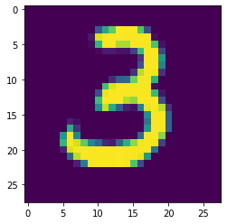
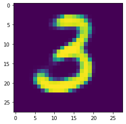
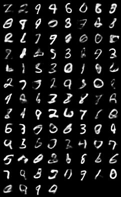
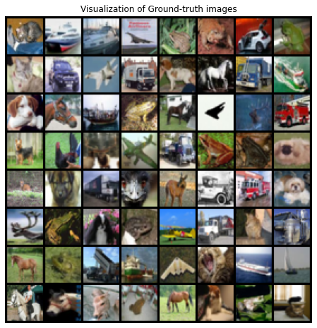
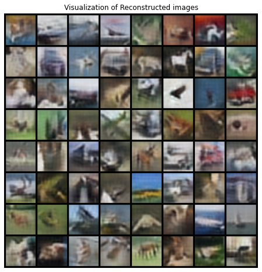
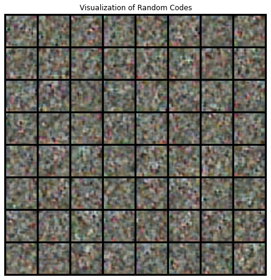

# VAE-tutorial
A simple tutorial of Variational AutoEncoder(VAE) models. This repository contains the implementations of following VAE families.

* [Variational AutoEncoder](https://arxiv.org/pdf/1312.6114.pdf) (VAE, D.P. Kingma et. al., 2013)
* [Vector Quantized Variational AutoEncoder](https://arxiv.org/pdf/1711.00937.pdf) (VQ-VAE, A. Oord et. al., 2017)

# Requirements
* [Anaconda](https://www.anaconda.com/products/individual#Downloads)
* python=3.7
* [pytorch](https://pytorch.org/)=1.7
* tqdm
* numpy

# How-to-use
simply run the <file_name>.ipynb files using jupyter notebook.

# Experimental Results
## Variational AutoEncoder (VAE)
- trained on MNIST dataset for 20 epochs
- groundtruth(left) vs. generated(reconstructed, right)

 

- generated random samples from noise vector

## Vector Quantized Variational AutoEncoder (VQ-VAE)
- trained on CIFAR-10 dataset for 50 epochs
- groundtruth(top) vs. reconstruction(bottom)

 

- randomly sampled codes from codebook

